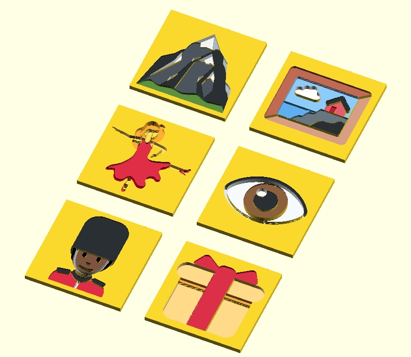
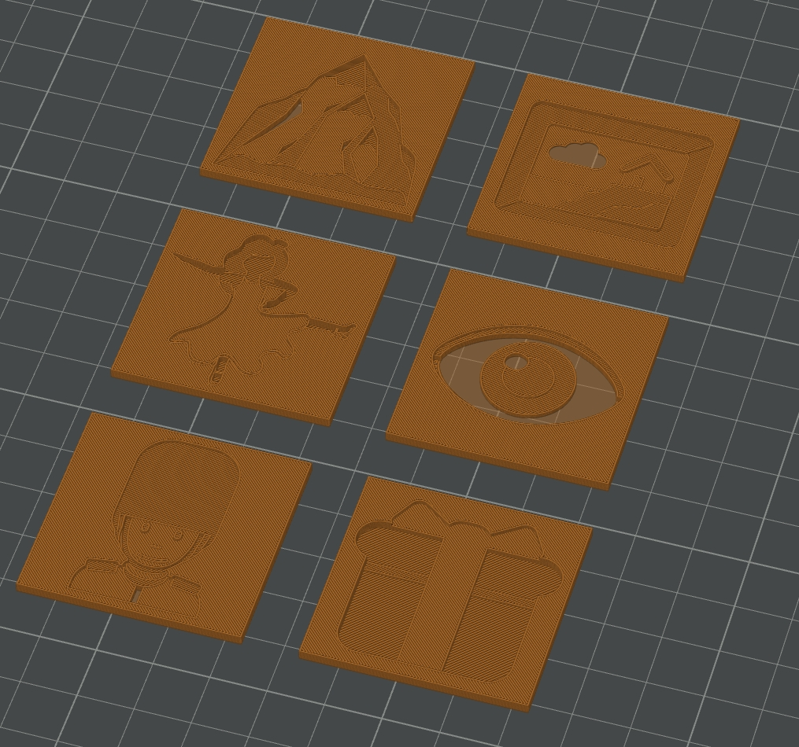

# Twitter Emoji (Twemoji) In OpenSCAD

A Twemoji is a set of emoji release by twitter in 2014 that provides standard Unicode [emoji](http://en.wikipedia.org/wiki/Emoji) support across all platforms.
This package supports inserting those characters with color to height mapping in OpenSCAD.


**Twemoji v14.0** adheres to the [Unicode 14.0 spec](https://unicode.org/versions/Unicode14.0.0/) and supports the [Emoji 14.0 spec](https://www.unicode.org/reports/tr51/tr51-21.html).


## Installing
This is a rather hefty thing to install at least by the standard of libraries.
But is only a few score MB so is no problem on a modern computer, with decent internet.
It is so large because it includes thousands of SVGs.

You can install this by downloading the release,
and extracting it into a [locaction OpenSCAD looks for libraries in](https://en.wikibooks.org/wiki/OpenSCAD_User_Manual/Libraries).

## Usage

Note: it is important this you load this via `use` not `include` as the library references paths relative to itself (if you use `include` then it would try and find them relative to your file).
```
use <open_scad_twimoji/src/twiemoji.scad>
```

There is at present 1 function.
`engrave_twiemoji` which should be used in partnership with `difference`.
This produces a colored 3D image of the emoji with each color matched to a different depth.
It takes 3 argnments

 - The emoji: _(required)_ pass this as a string. Make sure not to include any whitepace. This does incude every emoji in Unicode 14, but if you use some unicode character we do not recognise then you will get an error.
 - Depth/height: _(required)_ how deep to engrave the image
 - center: _(optional, default false)_ if true the anchor should be at the center of the XY plane, if false it is at bottom left


## Example
the following makes 6 tiles with 💂🏿,💃,🏔️,👁️, or 🖼️ engraved into it.
```openscad
use <open_scad_twimoji/src/twiemoji.scad>


difference(){
    translate([0,0,-1])
    cube([40,40, 2], center=true);
    engrave_twiemoji("💂🏿", 2, center=true);
};
translate([0,50,0])
difference(){
    translate([0,0,-1])
    cube([40,40, 2], center=true);
    engrave_twiemoji("💃", 2, center=true);
};
translate([0,100,0])
difference(){
    translate([0,0,-1])
    cube([40,40, 2], center=true);
    engrave_twiemoji("🏔️", 2, center=true);
};
translate([50,0,0])
difference(){
    translate([0,0,-1])
    cube([40,40, 2], center=true);
    engrave_twiemoji("🎁", 2, center=true);
};
translate([50,50,0])
difference(){
    translate([0,0,-1])
    cube([40,40, 2], center=true);
    engrave_twiemoji("👁️", 2, center=true);
};
translate([50,100,0])
difference(){
    translate([0,0,-1])
    cube([40,40, 2], center=true);
    engrave_twiemoji("🖼️", 2, center=true);
};
```
This is how it looks previewed in OpenSCAD
.

This is how it looks in my slicer:
.


## Developing:
While the `src` contains the source code for the OpenSCAD library, it is 100% generated code.

To actually change it, look in the `../generate` folder and edit the julia source code.

The actuals source is pretty general and could probably be used for any SVGs really.
As long as they just use fills and not strokes (or complicated things like embeddd PNGs or animations etc).

## License and attribution requirements 

### Graphichs (from Tweemoji)
Graphics licensed under CC-BY 4.0: <https://creativecommons.org/licenses/by/4.0/>
Copyright 2019 Twitter, Inc [and other contributors](https://github.com/twitter/twemoji/graphs/contributors)

The graphics are licensed under the CC-BY 4.0 which has a pretty good guide on [best practices for attribution](https://wiki.creativecommons.org/Best_practices_for_attribution).

However, we consider the guide a bit onerous and as a project, will accept a mention in a project README or an 'About' section or footer on a website. In mobile applications, a common place would be in the Settings/About section (for example, see the mobile Twitter application Settings->About->Legal section). We would consider a mention in the HTML/JS source sufficient also.


### OpenSCAD and Julia code

Code licensed under the MIT License: <http://opensource.org/licenses/MIT>
Copyright 2025, Frames Catherine White and [and other contributors](https://github.com/oxinabox/openscad_twemoji/graphs/contributors)

